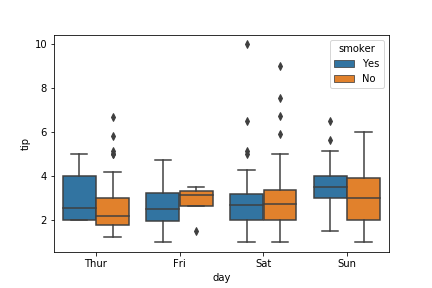

# `coursera_stats_1_understanding_visualizing_data`

These are my course notes for [Understanding and Visualizing Data](https://www.coursera.org/learn/understanding-visualization-data) course 1 from [Coursera Statistics with Python](https://www.coursera.org/specializations/statistics-with-python) specialization. 

Starting in July 2019.  
Patricia Schuster, University of Michigan  

# Week 1

* [Week 1 notes](week_1_notes.ipynb)
    * Where do data come from? organic/process data, designed data collection
    * i.i.d.: independent, identically distributed
    * Variable types: quantitative (continuous, discrete), categorical (ordinal, nominal)
    * Study design: Exploratory vs. confirmatory, comparative vs. non-comparative, observational vs. experiment, power and bias
    
# Week 2

* [Week 2 notes](week_2_notes.ipynb)
    * Categorical data: tables, bar charts, pie charts
    * Quantitative data: histogram, numerical summaries, standard score, box plots
    * Tables, histograms, and boxplots in Python
    * Examples with the `tips_data` dataset from `seaborn`
    

# Week 3

* [Week 3 notes](week_3_notes.ipynb)
    * Multivariate data
    * Associations with multivariate quantitative data
    * Pizza study design assignment
    * Quiz
